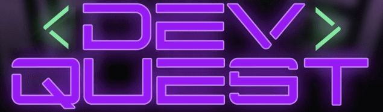

  

# Projeto MovieFlixAPI
 Este projeto foi desenvolvido no curso de Backend da [DevQuest](https://github.com/devemdobro) com o objetivo de integrar os conhecimentos em banco de dados e NodeJs. 

## Tecnologias utilizadas:

- NodeJs
- Express
- TypeScript
- PostgreSQL
- Prisma
- Swagger
  
## Resultado

